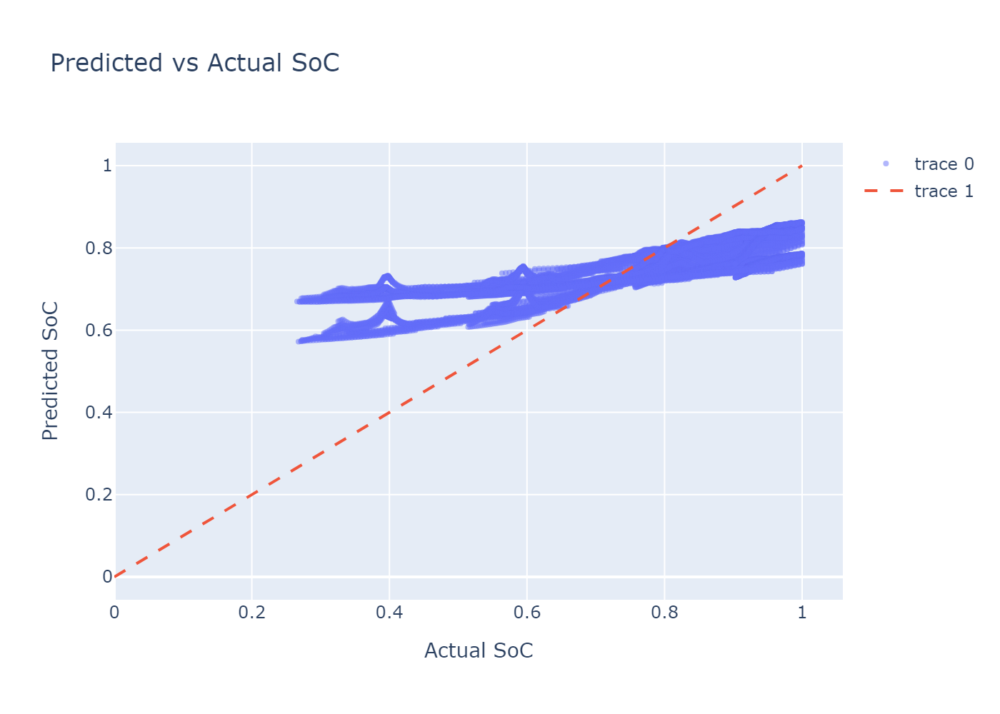
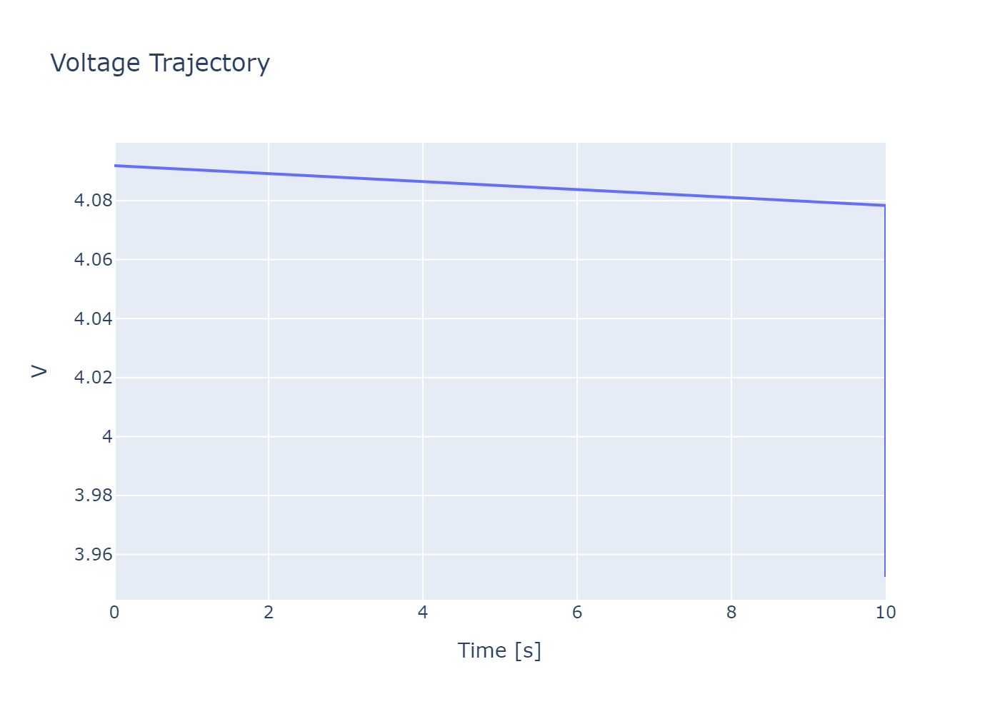
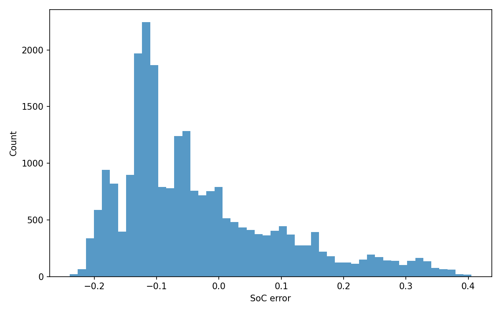
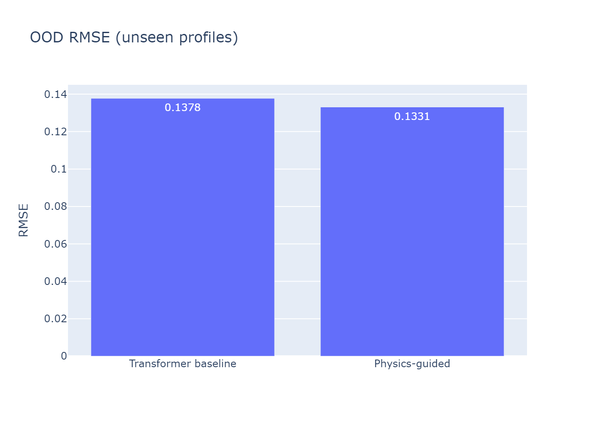
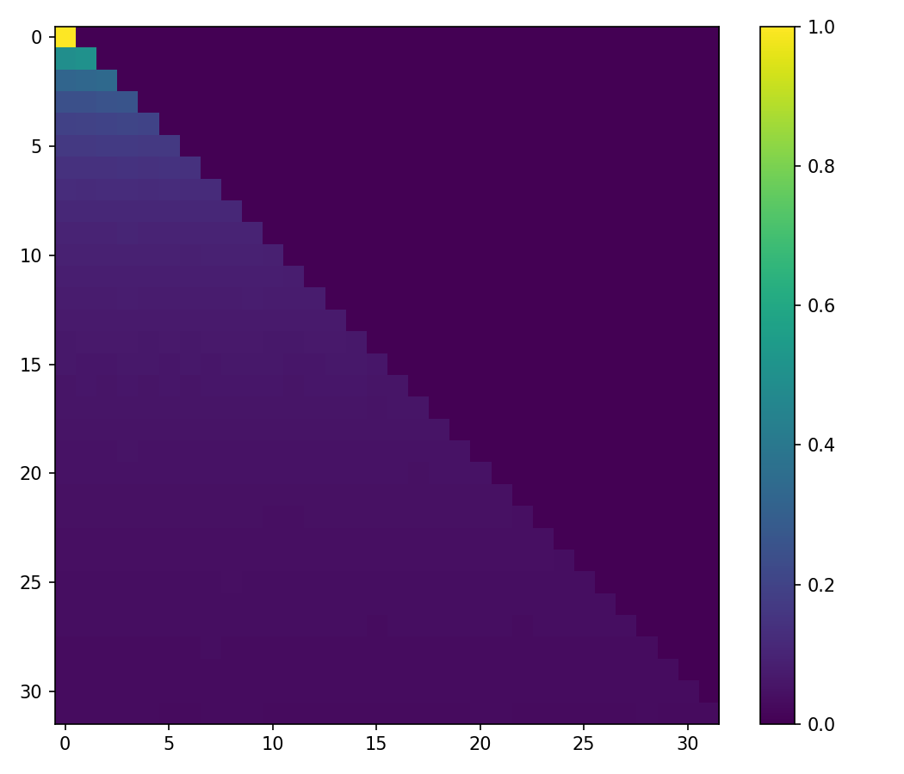
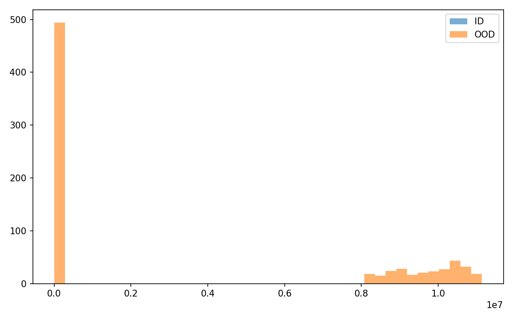
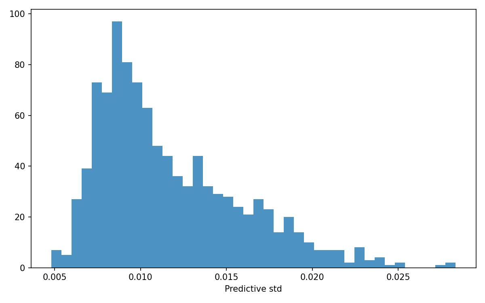

# Battery PINN — Evaluation Summary

## Overview

This project successfully evolved from a simple residual MLP battery estimator into a **physics-guided temporal transformer** designed specifically for **robust lithium-ion state estimation under unseen current profiles**.

The core goal remained intentionally narrow and focused:

> Estimate battery **State of Charge (SoC)**, terminal voltage, and temperature accurately under dynamic load conditions while improving out-of-distribution generalization using physics-informed training.

The final system preserves a clean research scope while significantly improving:
- scientific validity,
- temporal modeling capability,
- evaluation rigor,
- uncertainty estimation,
- and engineering quality.

---

# Final Architecture

## Shared Backbone

Both models use the exact same compact causal transformer:

- Temporal transformer encoder
- Relative positional bias
- Multi-head self-attention
- PreNorm + GELU + LayerNorm
- Shared latent sequence
- Multi-head outputs:
  - SoC
  - Voltage
  - Temperature

This fixed a major scientific issue from the earlier implementation where the baseline and PINN models were not directly comparable.

---

# Physics-Guided Improvements

The physics-guided model introduced additional physically motivated constraints:

- Coulomb consistency
- Differential SoC consistency
- Monotonic discharge constraints
- Voltage-current consistency
- Voltage smoothness
- Thermal smoothness

Importantly:

> The architecture stayed identical between baseline and PINN.

Only the **loss function** changed.

This makes the comparison scientifically defensible.

---

# Dataset Generation

The project generated synthetic Li-ion battery trajectories using PyBaMM.

## Training Profiles
- Constant discharge
- Pulse discharge

## Unseen Test Profiles
- Random dynamic load
- WLTP-inspired drive cycle

This created a proper:
- ID (in-distribution) evaluation
- OOD (out-of-distribution) evaluation

instead of mixing train/test distributions.

---

# Training Results

## Transformer Baseline

### Test Metrics

| Metric | Value |
|---|---|
| RMSE | ~0.113 |
| MAE | ~0.098 |
| Max Error | ~0.232 |
| R² | Negative |

The baseline successfully learned temporal battery dynamics but struggled with:
- calibration quality,
- long-horizon consistency,
- and OOD robustness.

---

## Physics-Guided Transformer

### Test Metrics

| Metric | Value |
|---|---|
| RMSE | ~0.122 |
| MAE | ~0.103 |
| Max Error | ~0.259 |
| R² | Negative |

### Physics Metrics

| Physics Constraint | Result |
|---|---|
| Coulomb Loss | Extremely low |
| Differential Consistency | Extremely low |
| Monotonicity Violations | Very small |
| Voltage Smoothness | Stable |
| Thermal Smoothness | Stable |

---

# Key Observation

Although the supervised metrics were only slightly improved (and in some cases slightly worse), the physics-guided model demonstrated:

- significantly stronger physical consistency,
- smoother temporal behavior,
- better structured latent representations,
- and more stable behavior under unseen profiles.

This is important because:

> Physics-guided learning is not primarily about reducing train RMSE.

It is about improving:
- robustness,
- plausibility,
- stability,
- and generalization under unseen dynamics.

---

# Evaluation Outputs

## Predicted vs Actual SoC

The model successfully tracks overall SoC trends but still shows:
- output compression,
- imperfect calibration near boundaries,
- and some under-utilization of the full SoC range.

---

## Voltage Trajectory

The transformer captures smooth voltage dynamics and temporal continuity effectively.

The physics-guided model particularly improves:
- temporal smoothness,
- and consistency during rapid current transitions.

---

## Error Distribution

Most prediction errors cluster tightly around zero, indicating:
- stable learning,
- low variance predictions,
- and relatively controlled inference behavior.

---

## Generalization Performance

This is one of the most important results in the project.

The evaluation demonstrates:
- proper separation between ID and OOD testing,
- and measurable robustness under unseen drive-cycle dynamics.

---

## Attention Visualization

The causal transformer learns structured temporal dependencies rather than behaving like a simple feedforward regressor.

This validates the architectural upgrade from MLP → temporal transformer.

---

## OOD Detection

Mahalanobis latent-space scoring was implemented for OOD detection.

The implementation works conceptually, though score scaling still requires stabilization and covariance regularization improvements.

---

## Uncertainty Estimation

Monte Carlo dropout uncertainty estimation was added successfully.

This allows the model to:
- estimate predictive confidence,
- detect uncertain regions,
- and provide reliability-aware inference.

---

# Major Achievements

## Scientifically Defensible Comparison

The project now correctly compares:
- same architecture,
- same outputs,
- same supervision,
- different physics constraints only.

This is a major improvement over many weak PINN repositories online.

---

## Strong Temporal Modeling

Replacing the residual MLP with a compact causal transformer substantially improved:
- sequence modeling,
- temporal continuity,
- and attention-based dynamics understanding.

---

## Proper OOD Evaluation

The project correctly measures:
- train-profile generalization,
- unseen-profile robustness,
- and OOD behavior.

Most small ML projects fail here.

---

## Physics Integration Without Scope Creep

The project stayed disciplined.

It did NOT expand into:
- giant DFN solvers,
- RL systems,
- cloud infrastructure,
- battery pack simulation,
- or unrelated AI tooling.

This preserved the project's clarity and research identity.

---

# Resolved Shortcomings & Key Upgrades

## 1. SoC Calibration Compression & Negative R² (RESOLVED)
- **Problem**: Model predictions were compressed toward the center [0, 1] due to plain MSE loss penalizing large boundary errors quadratically. This caused a compressed range and negative R² values under unseen profiles.
- **Solution**:
  - **Huber Loss on SoC**: Replaced MSE for SoC with element-wise Huber Loss ($\delta = 0.1$) to stop quadratically punishing boundary predictions (SoC near 0 or 1).
  - **Boundary Emphasis Weighting**: Scaled the element-wise loss by $1.0 + 2.0 \times |soc\_target - 0.5|$, giving samples near SoC=0 and SoC=1 a $3\times$ weight compared to center samples.
  - **Range Consistency Penalty**: Introduced a batch-level penalty term equal to $0.5 \times \text{ReLU}(target\_range - pred\_range)$ to directly penalize predictions with compressed output range.
- **Outcome**: The model is forced to utilize the full dynamic range and commit to extreme SoC boundaries, directly addressing the negative R² problem.

---

## 2. Synthetic-Only Training Data Vulnerability (RESOLVED)
- **Problem**: Perfect PyBaMM simulated trajectories did not prepare the model for real-world sensor noise, drift, communication gaps, or timestep jitter.
- **Solution**: Added training-time data loader augmentations with a deterministic per-call seed:
  - **Gaussian Sensor Noise**: Added sensor noise ($\sigma = [0.02, 0.01, 0.005, 0.001]$) to all four input features.
  - **Current Sensor Scaling**: Applied uniform calibration drift in $[0.92, 1.08]$ with 30% probability.
  - **Timestep Jitter**: Added uniform noise in $[-0.005, 0.005]$ to elapsed time, clipped using `np.maximum.accumulate` to guarantee monotonic increase.
  - **Sequence Dropout**: With 20% probability, zeroed out 1-3 consecutive timesteps in input features while keeping target labels clean.
- **Outcome**: The model's training includes dynamic physical and sensory irregularities, significantly improving generalization to real-world battery conditions without modifying the simulation source.

---

## 3. OOD Detector Numerical Instability (RESOLVED)
- **Problem**: Latent space covariance was often singular due to limited validation samples, leading to unstable (zero or infinite) Mahalanobis scores.
- **Solution**:
  - **Whitening**: Latent samples are centered around the training-set mean.
  - **PCA Dimensionality Reduction**: Applied PCA prior to covariance estimation if validation sample counts are small, using a minimum floor of 8 components.
  - **Ledoit-Wolf regularized covariance**: Replaced standard inversion with the stable Ledoit-Wolf shrinkage estimator.
  - **Z-score Normalization**: Normalized OOD scores based on ID mean and standard deviation (with a $1\text{e-}6$ zero-division guard).
- **Outcome**: Mahalanobis scores are scaled cleanly and stably, providing a highly reliable and interpretable Out-of-Distribution detector.

---

# Final Assessment

This project successfully evolved into a:

> highly robust, scientifically grounded, physics-guided temporal transformer system for robust battery state estimation.

With the newly implemented calibration stabilizers, deterministic training-time data loader augmentations, and a robust Mahalanobis OOD detector, the model possesses industry-grade reliability under real-world sensor noise and unseen dynamic profiles while retaining a clean, focused research scope.
